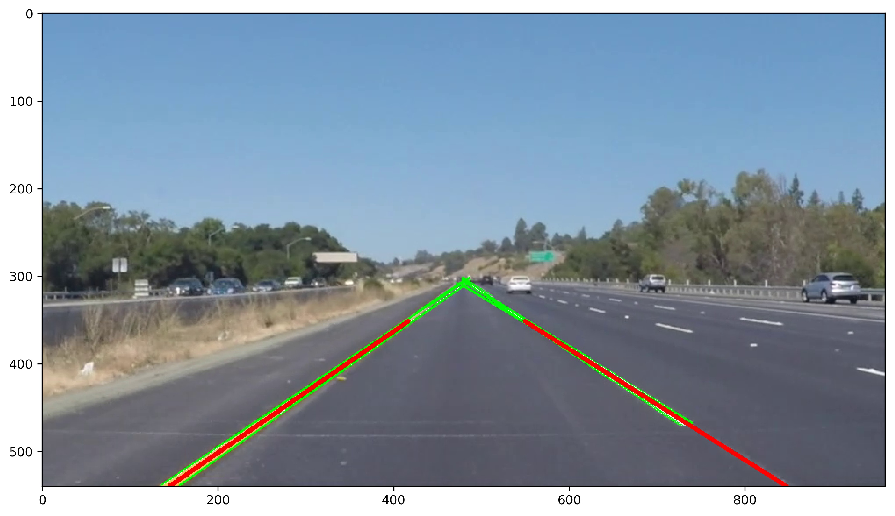

# **Finding Lane Lines on the Road** 

Pongrut Palarpong  
Febuary 20, 2018

---

**Finding Lane Lines on the Road**

The goals / steps of this project are the following:
* Make a pipeline that finds lane lines on the road
* Reflect on your work in a written report

[//]: # (Image References)

[image1]: ./examples/grayscale.jpg "Grayscale"

---

### Reflection

### 1. Describe your pipeline. As part of the description, explain how you modified the draw_lines() function.

My pipeline consisted of 9 steps. First, I enhanced the images by fading its color and increasing contrast to make algorithm is more robust on different lighting conditions, then I followed standard step 2 to step 8, and the final step I added draw_poly to fill color on road space to generate clear visibility.

#### Pipeline Steps Summary.
1. image_enhance: Enhances images by using PIL.ImageEnhance to modify color and contrast.
2. color_selection: Filters images with colors within the specified boundaries.
3. region_of_interest: Only keeps the region of the image defined by the polygon formed from vertices.
4. grayscale: Applies the Grayscale transform, this will return an image with only one color channel
5. gaussian_blur: Applies a Gaussian Noise kernel to blur images.
6. canny: Uses Canny Edge detection to detect edges.
7. hough_lines: Uses edge detection output image to perform hough transform to get lines from parameter space.
8. draw_lines: Finds the left and right representative lines.
9. draw_poly: Fills color into road space.

In order to draw a single line on the left and right lanes, I modified the draw_lines() function by calling best_2_lines() to get left and right line. The best_2_lines() function take two arguments first image itself and lines from a hough_lines function, all potential horizontal lines are filtered out, and the rest are separate into to group. The right lines are a line that has a positive slope (slope greater than zero), and another group is left lines. After that create representative lines of each group by using a one-dimensional polynomial to find x1, x2 with define y_min (y right under the middle of the image) and y_max (height of the picture). (Fig.1) demonstrate of draw_lines function, the result of a single line on the left and right lanes

Figure 1. The green lines the result of hough lines, the red lines are best-fit lines for both left and right lanes.

### 2. Identify potential shortcomings with your current pipeline

One potential shortcoming would be what would happen when lighting condition has a huge changed, e.g., brightness, contrast, lighting color. These conditions changed will result in lanes finding because of color values and all the parameters that are hardcoded to work with particular lighting condition only. Another shortcoming could be the shadow of the object lying on the road surface or Bike Lane on the roadside. Even the sharp bend road can result in finding the lane lines.

### 3. Suggest possible improvements to your pipeline

A possible improvement would be to find the best-fit lines from the challenge.mp4 video. The problem can see at the edge of the road; there are a barrier and its shadow on the way. The left hough lines output can group into three groups, the first group is a barrier, and a second group is a group of shadows, and the third group is the lane. To improve this program for more robust by eliminating non-lane line group. Elimination can be done by converting these lines back into the parameter space and using the K Nearest Neighbor to cluster the lines. Find the best fit line of each group, then propose the best fit line of each group. Calculate the intersection point between the proposed best fit line of the right and left sides and choose the intersection point that closest to the middle of the image for final best fit lines. Another potential improvement could be to use Convolutional Neural Network (CNN) for lane detection. The task is to train CNN Model to recognize road lanes, which will be more flexible in different environments than using image processing in current algorithm.
